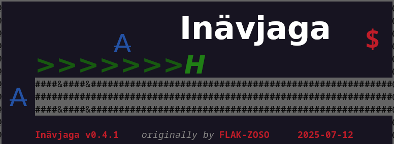
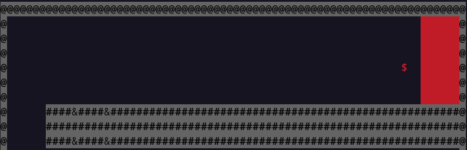

# Inävjaga

**Inävjaga** is a [Sista](https://github.com/FLAK-ZOSO/Sista)-based C++ terminal videogame.



## Installation

### From release executable

You can download the latest release executable for your operative system from the [releases page](https://github.com/FLAK-ZOSO/Inavjaga/releases).

https://github.com/user-attachments/assets/9b4b2371-a87a-4a30-b22d-b42b4e279a4a

This approach is unlikely to work for MacOS users for the following reasons:
- the game is not signed, so it will be blocked by the system;
- the game is not statically linked and that's impossible to achieve [by Apple's design choices](https://discussions.apple.com/thread/1945589?sortBy=rank) despite [various attempts](https://github.com/skaht/Csu-85/issues/2) to do so;
Thus, if you are a MacOS user, you should compile the game from source as explained below.

### From source

This approach allows you to customize the game (by editing `constants.hpp`) and access the source code.

The requisites for this approach are:
- familiarity with the shell that your operative system provides
- `git` version control system
- `g++` compiler, must support ISO C++17 or GNU C++17
- `make` utility

You can potentially use just `g++` and copy-paste the commands from the `Makefile` or from below.
The same goes for `git`, you can download the source code as a ZIP archive, but using `git` is recommended for pulling updates without downloading the whole archive again.

You can clone the repository and compile the game from source as follows:

```bash
git clone https://github.com/FLAK-ZOSO/Inavjaga
cd Inavjaga
make
```

If you don't have `make` installed, you can copy and paste the following commands in your terminal:

```bash
g++ -std=c++17 -Wall -g -c include/sista/ANSI-Settings.cpp include/sista/border.cpp include/sista/coordinates.cpp include/sista/cursor.cpp include/sista/field.cpp include/sista/pawn.cpp
g++ -std=c++17 -Wall -g -c inavjaga.cpp -Wno-narrowing
g++ -std=c++17 -Wall -g -o inavjaga inavjaga.o ANSI-Settings.o border.o coordinates.o cursor.o pawn.o field.o
```

After compiling the game, you can run it with:

```bash
# On Linux and MacOS (or other Unix-like systems)
./inavjaga
```

```bash
# On Windows (cmd.exe, while PowerShell goes with `.\inavjaga.exe`)
inavjaga.exe
```

If you compile the game from source, you will be able to customize and rebalance the game by editing the `constants.hpp` file and not only.

## Description

### Purpose

Your character is represented by the `$` symbol and is surviving day by day hunting for food and protecting its home from the dangers of the tunnels.



If the enemies will reach home, no hopes will be left, so you need to defend it at all costs.

### Worms

The tunnels are haunted by worms such as the one represented below.

```bash
>>>>
   v
   v>H
```

Vulnerable to headshots, worms leave behind clay that can be used to craft mines.

### Archers

The archers are smart enemies who know well the tunnels and can move through the breaches in the walls.

```bash
A
```

They can shoot you from a distance, so you need to be careful when they are around. If you manage to kill them, you can harvest their arrows.

### Resources

The game features various resources that you can collect:

- **Clay**: can be used to craft mines; it is left behind by worms;
- **Bullets**: can be fired; as such both archers' arrows and worms' scales can be used as bullets;
- **Meat**: is eaten to avoid starving; it is dropped by worms and archers;

### Portals

The game features portals that can be used exclusively by the player to travel between different areas of the tunnels.

```bash
&
```

## Instructions

### Controls

The controls for motion are:
- `W`, `A`, `S`, `D`: move the character; both uppercase and lowercase letters work;

The controls for executing actions are:
- `I`, `J`, `K`, `L`: interact with the world; both uppercase and lowercase letters work;

The controls for switching modes are:
- `c`: switch to the ***collect*** mode; both uppercase and lowercase letters work;
- `b`: switch to the *shoot **bullet*** mode; both uppercase and lowercase letters work;
- `m`: switch to the *build **mine*** mode; both uppercase and lowercase letters work;
- `e`: switch to the *dump **chest*** mode; both uppercase and lowercase letters work; lowercase `q` works too;

The controls for game actions are:
- `Q`: quit the game; only uppercase letter works;
- `p`: pause the game and force reprint of the screen; both uppercase and lowercase letters work; `.` works too;
- `+`, `-`: speed up/down the game by a factor of 4; both `+` and `-` work;
